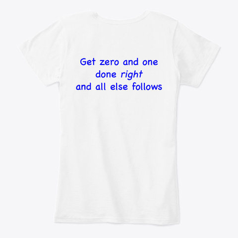
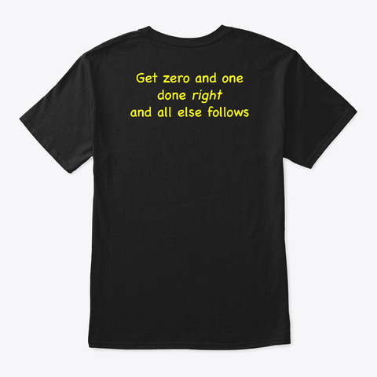

# t-shirts!

If an idea is compact and elegant, it should work on a t-shirt.

These are not a good deal, but research like this that has taken
decades is expensive. With the fees and all, the t-shirts cost
some $30, while the hoodie clocks in at $50. Ouch. Still, nothing
like these anywhere else on the planet. Consider it :-)

Each design comes in a variety of colors and the usual range of sizes.

[The teespring store](https://teespring.com/stores/visualphysics)

### The 5 most important equations in all of physics

#### in white - click to go to store

#### in black, Always here now and seen

