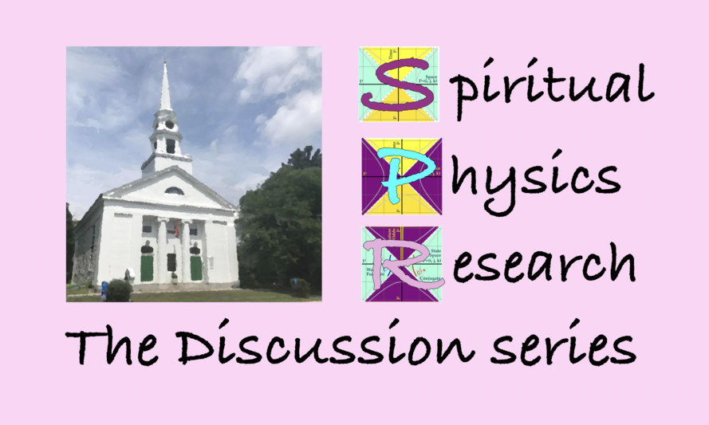

An effort by First Church Unitarian, Littleton, MA

Rev. Lara Hoke will provide a spiritual framework.

Doug Sweetser will bring on the simple but odd math.

## Topics:

1. The 5 most important equations in all of physics [Slides](Slides/2021-01__SPR__5_eqs.pdf) or [47' video](https://bit.ly/SPR_1_video)
1. Relativity, what we disagree on, calculations we agree on
1. A new road to gravity
1. Quantum mechanics wierdness and mirrors
1. Visualizing physics

## T-shirts

These are not a good deal, but research like this that has taken
decades is expensive. With the fees and all, the t-shirts cost
some $30, while the hoodie clocks in at $50. Ouch. Still, nothing
like these anywhere else on the planet. Consider it :-)

[The teespring store](https://teespring.com/stores/visualphysics)

